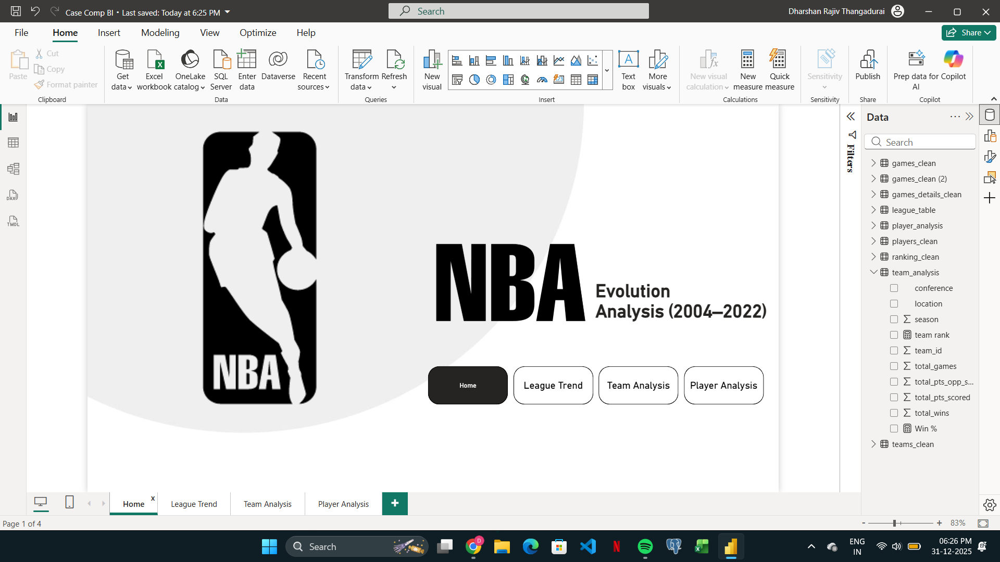
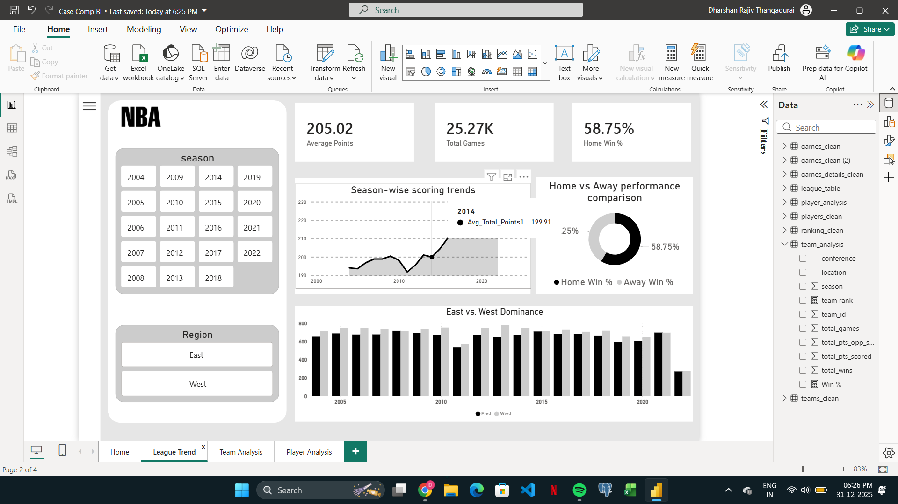
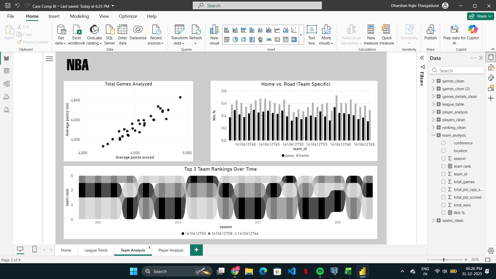
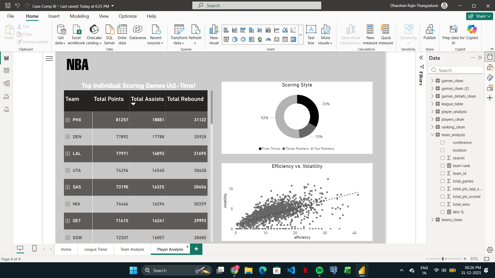

# 🏀 NBA Evolution Analysis (2004–2022) 
### *Statistella Data Analytics Challenge | IIT (BHU) Varanasi*

## 📖 Project Overview
[cite_start]This project is an interactive data visualization of NBA league history, spanning from 2004 to 2022[cite: 27]. [cite_start]Developed as part of a data analytics competition, the dashboard transforms complex datasets—including game outcomes, player stats, and team rankings—into a clear narrative of how the game has evolved[cite: 25, 26].

## 🖼️ Dashboard Gallery
Below are the key views of the multi-page report. [cite_start]Each page is designed for high interactivity and visual clarity[cite: 56, 57].

| Page | Preview 
| :--- | :--- 
| **Home Page** |  
| **League Trend** | 
| **Team Analysis** |  
| **Player Analysis** |  

## 🛠️ Data Engineering & Cleaning
[cite_start]To meet the **Statistella evaluation criteria for Accuracy**[cite: 54], the following ETL steps were performed using Power Query:

* **Data Normalization:** Cleaned and structured raw CSVs into organized tables: `games_clean`, `players_clean`, and `ranking_clean`.
* [cite_start]**Relationship Modeling:** Built a Star Schema to link player performance directly to game outcomes and team metadata[cite: 28].
* [cite_start]**DAX Measures:** Developed custom measures for win-loss ratios and scoring trends to drive the dynamic visuals[cite: 50].
* [cite_start]**Interactive Filters:** Implemented a global **Filter Panel** for Season, Team, and Player selection[cite: 51].

## 📊 Key Insights
* **The 3-Point Shift:** The data highlights the dramatic increase in three-point attempts as a primary scoring method over the last decade.
* **Home Court Advantage:** Analysis confirms a consistent ~58% win rate for home teams across the dataset.
* **League Dominance:** The dashboard tracks the shifting power balance between the Eastern and Western conferences.

## 🚀 How to Explore
1.  Download the `.pbix` file from this repository[cite: 66].
2.  Open the file using **Power BI Desktop**.
3.  Use the on-screen buttons to navigate through the different analytical views.

---
**Developed by:** Dharshan | NIT Trichy  
[cite_start]**Competition:** Statistella - Science and Technology Council, IIT (BHU) Varanasi [cite: 20]  
**Tools:** Power BI, DAX, Power Query
